TryHackMe - Advent of Cyber 3 (2021)

<!-- more -->

# [TryHackMe - Advent of Cyber 3 (2021)](https://tryhackme.com/room/adventofcyber3)


The TryHackMe - Advent of Cyber 3 just launched today on the 1st of December 2021 and there are a lot of prizes to win.

The room consists of completing a new, beginner friendly security exercise every day leading up until Christmas;

I will be updating this walkthrough daily for each challenge.

##  [Day 1] **`Web Exploitation`** Save The Gifts

This task is based on Insecure Direct Object Reference or IDOR for short.

The explanations are all provided on the challenge page.

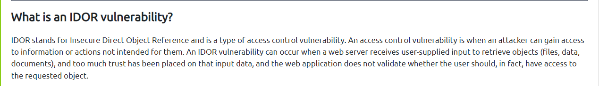

### **Challenge Walkthrough**

After finding Santa's account, what is their position in the company?

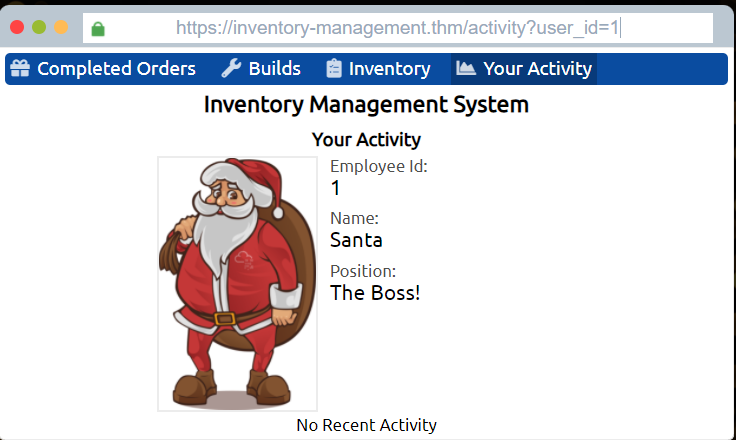

Santa’s `user_id` is `1`

>The Boss!

After finding McStocker's account, what is their position in the company?

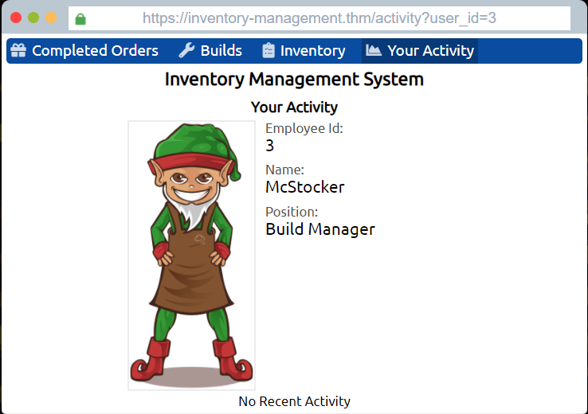

McStocker's `user_id` is `2`

>Build Manager

After finding the account responsible for tampering, what is their position in the company?

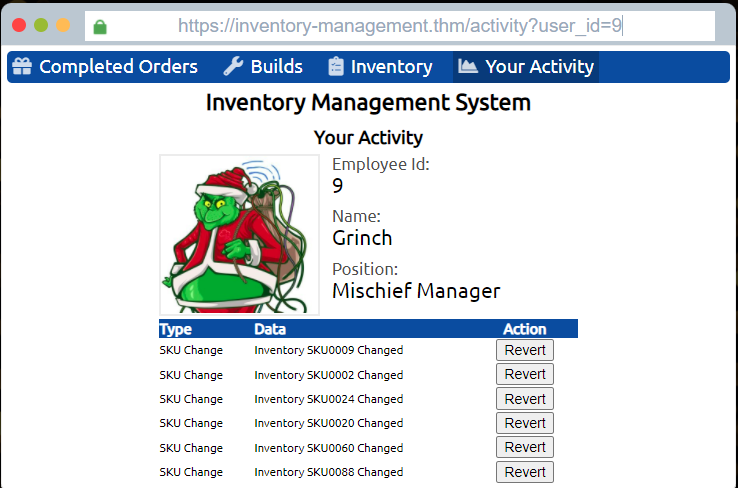

The account responsible for tampering is `Grinch’s` and `user_id` is `9`

>Mischief Manager

What is the received flag when McSkidy fixes the Inventory Management System?

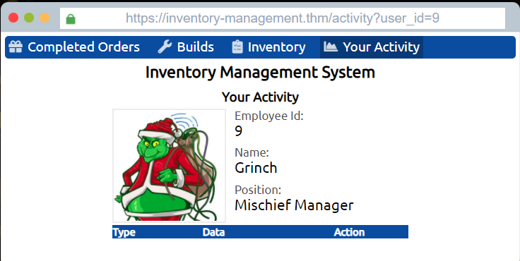

Once all the actions are revoked, the flag is displayed.

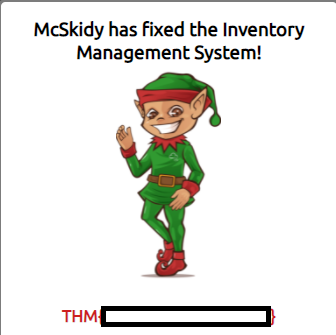

>THM{Fake_Flag}


##  [Day 2] `Web Exploitation` Elf HR Problems

This task is based on understanding the underlying technology of web servers and how the web communicates.

The objective is to know what cookies are and their purpose, and to learn how to manipulate and manage cookies for malicious use.

More details can be found on the challenge page.

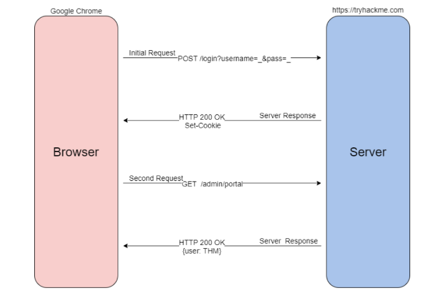

### **Challenge Walkthrough**

Register an account, and verify the cookies using the Developer Tools in your browser.

The registration process goes as follows:

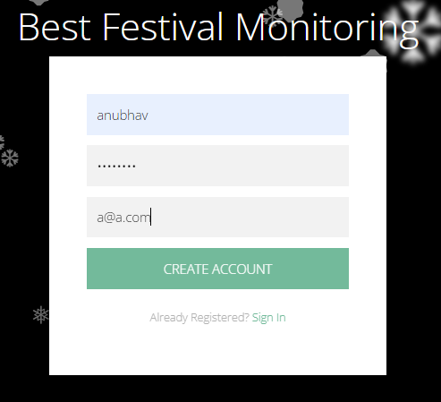

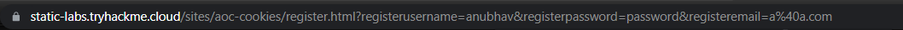

It can be determined that the website uses `GET` method to send the sign up data to the server, as all the user input can be seen in the browser’s URL bar.

Once registered, the following is displayed.

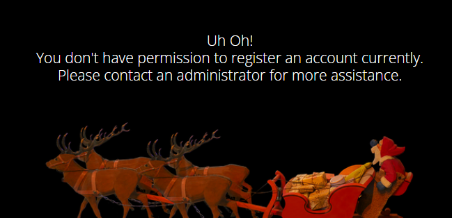

What is the name of the new cookie that was created for your account?

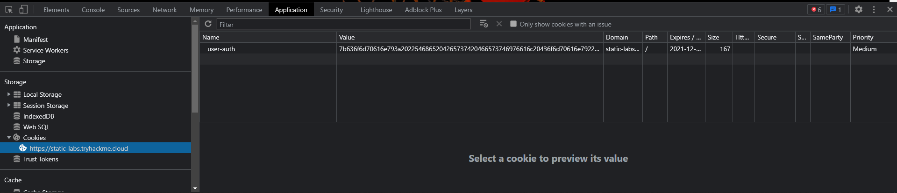

>user-auth

What encoding type was used for the cookie value?

The cookie value can be deduced to be of `Hex` as it contains `0 -9 A-F`.

>hexadecimal

What object format is the data of the cookie stored in?

CyberChef is a simple, intuitive web app for analysing and decoding data without having to deal with complex tools or programming languages. 

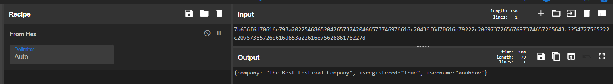

The output of the decoded cookie is in JSON or Javascript Object Notation format.

>JSON

Manipulate the cookie and bypass the login portal.

What is the value of the administrator cookie? (username = admin)

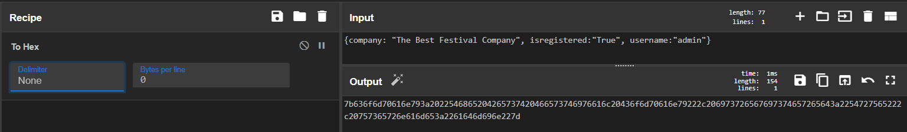

```
7b636f6d70616e793a2022546865204265737420466573746976616c20436f6d70616e79222c206973726567697374657265643a2254727565222c20757365726e616d653a2261646d696e227d
```

What team environment is not responding?

After replacing the current user’s cookie with the new crafted cookie, admin access is granted

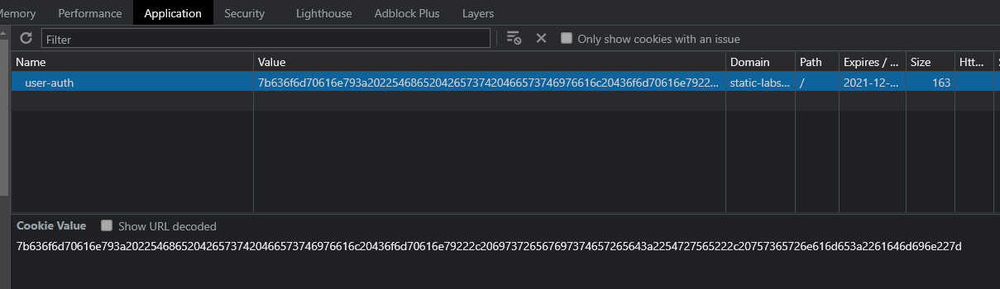

The following page is then displayed upon going to the following URL.

`https://static-labs.tryhackme.cloud/sites/aoc-cookies/monitor.html`

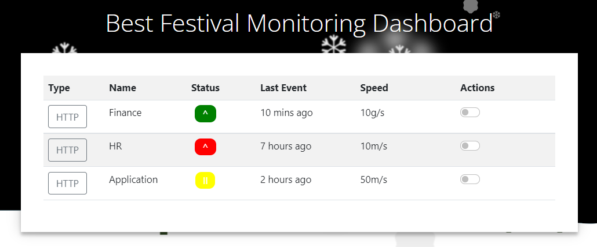

The team that is not responding is `HR`

>HR

What team environment has a network warning?

The team having network warning is `Application`

>Application
